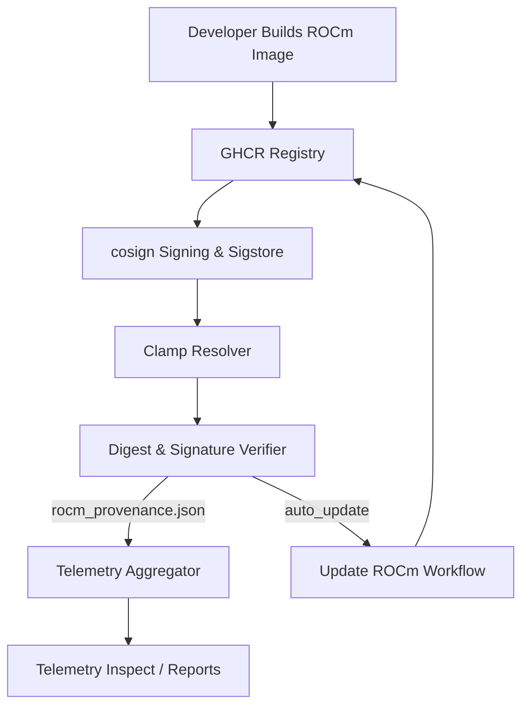

# Clamp Provenance Overview (Phase 4)

Clamp’s ROCm supply chain verification ensures every container image used in CI and telemetry is traceable, signed, and recorded. The flow connects developers, registries, signature infrastructure, Clamp CI, and downstream analytics.

## Checkpoints
1. **Developer → GHCR**: ROCm container images are published to `ghcr.io/rocm/dev` with versioned tags.
2. **cosign / Sigstore**: Images are signed using cosign; signatures and attestations are uploaded to Sigstore (Fulcio + Rekor). Clamp trusts specific public keys or identity/issuer pairs recorded in `ci/rocm_matrix.yml`.
3. **Clamp Resolver**: `ci/resolve_rocm.py` selects the preferred `version-os` pairing based on policy and emits `image@digest` for CI.
4. **Verifier**: `ci/verify_rocm_digest.py` validates digest integrity, enforces policy (`strict`, `warn`, `auto_update`), and now runs `cosign verify` to confirm signatures. Results (issuer, timestamp, trust status, policy path) are written to `rocm_provenance.json`.
5. **Telemetry Aggregator**: `TemporalAggregator::accumulate` reads both telemetry sessions and provenance metadata, embedding trust evidence (issuer, algorithm, status) into `telemetry_summary.json`.
6. **Reports / CLI**: `telemetry_inspect` displays provenance alongside stability metrics, and summaries feed follow-on reports.
7. **Auto-Update PR**: When drift or signature failure occurs under `auto_update`, the verifier dispatches `.github/workflows/update-rocm.yml`, which refreshes digests, captures attestation data, and opens an “Auto-update ROCm matrix” PR containing updated provenance fields.

## Auto-Update PR Contents
The automated PR now includes:
- Updated `ci/rocm_matrix.yml` entries with digest and `provenance` metadata (issuer fingerprint, identity regex).
- Refreshed `rocm_provenance.json` artifact summarizing the latest verification run.
- Workflow logs (attached as artifacts) containing cosign verification output and attestation hashes.

This integration provides a continuous, trusted chain of evidence from container build through CI execution and telemetry reporting.
